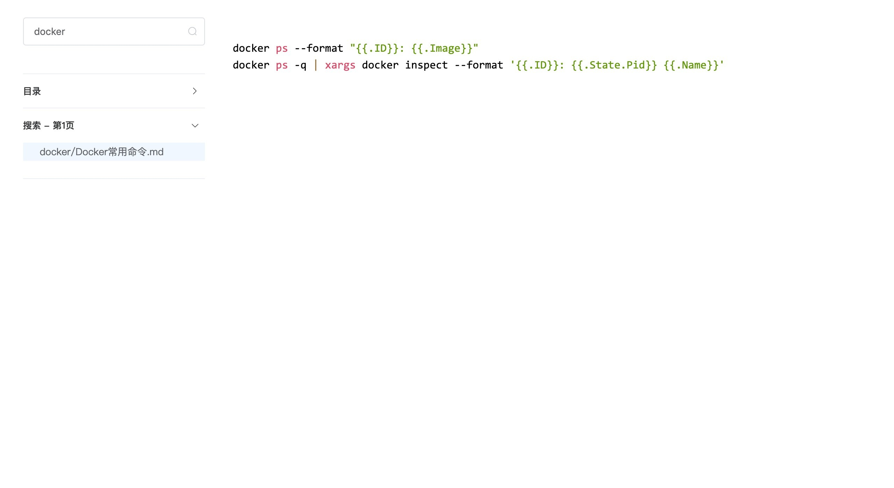

# Markup - 微型Markdown文档服务器

Markdown静态文档服务器，提供内容目录、搜索功能

所有文档都缓存在内存中，针对少量文档（博客、接口文档）场景优化


## 部署
### 方式1. 下载[markup.jar](https://github.com/canghailan/markup/releases/download/v1.0.0/markup-1.0.0.jar)，命令行启动
```shell
java -jar markup.jar
# 根据提示输入
git: https://github.com/canghailan/notes.git # Git仓库地址
```


### 方式2. docker
```yaml
version: '2'

services:
  markup:
    image: registry.cn-hangzhou.aliyuncs.com/yitong/markup
    environment:
      - 'MARKUP_GIT=https://github.com/canghailan/notes.git' # Git仓库地址
```


启动后，通过 http://localhost 即可访问，默认UI仅提供文件浏览、搜索功能，建议在Git仓库中提供index.html覆盖默认UI


## 配置
### 方式1. ```markup.yml```文件配置
配置文件与markup.jar放在同一目录下
```
markup.jar
markup.yml
```

配置项：
```yaml
git: https://github.com/canghailan/notes.git
port: 80 # 可选，默认80
```


### 方式2. 环境变量配置
```
MARKUP_GIT
MARKUP_PORT
```


### 方式3. 交互配置
```shell
java -jar markup.jar
git:
```
启动后将会自动保存到 ```markup.yml```


## 接口
### 首页
```http
GET /
```
或者
```http
GET /index.html
```


### 文件
与版本库文件路径一致
```http
GET /**/*.*
```


### 目录（Table Of Content）
```http
GET /.toc
```


### 全文搜索
搜索参数：
* p 目录
* q 关键词，有关键词结果按相关性排序，无关键词结果按文件创建时间倒序排序
* n 分页大小
* c 分页标识

搜索结果：
* list 搜索数据
* cursor 分页标识，null表示已到最后一页
#### 第一次请求
```http
GET /.s?p=&q=&n=

{
  "list": [],
  "cursor": "CURSOR"
}
```
#### 翻页
```http
GET /.s?c=CURSOR

{
  "list": [],
  "cursor": ""
}
```


### 更新，支持Webhook
```http
GET /.updater
```
或者
```http
POST /.updater
```


## 依赖
* [jgit](https://github.com/eclipse/jgit) - 从远程Git仓库读取文件
* [commonmark](https://github.com/atlassian/commonmark-java) - Markdown转HTML
* [lucene](https://github.com/apache/lucene-solr) - 文档存储、搜索
* [HanLP](https://github.com/hankcs/HanLP)、[hanlp-lucene-plugin](https://github.com/hankcs/hanlp-lucene-plugin) - 中文分词、拼音
* [jackson](https://github.com/FasterXML/jackson) - YAML配置文件、HTTP接口
* [netty](https://github.com/netty/netty) - HTTP服务器


## License
MIT


## 预览
